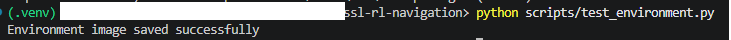
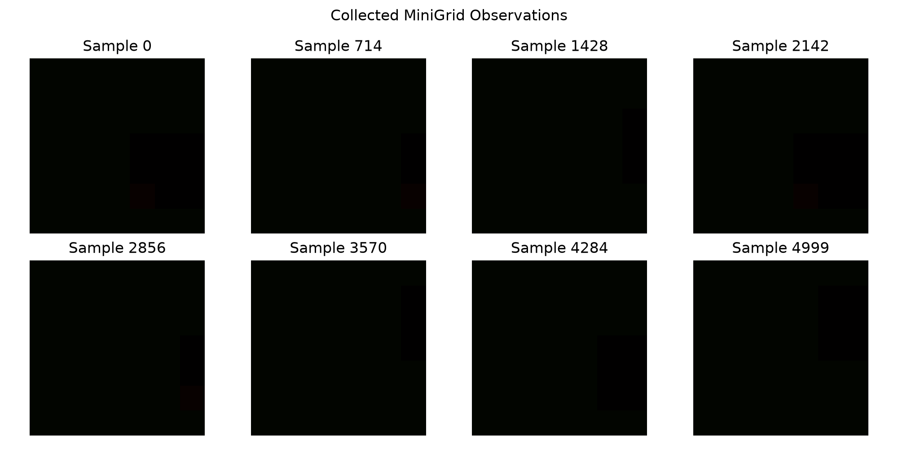
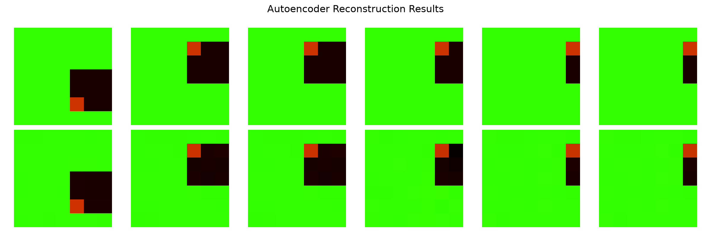
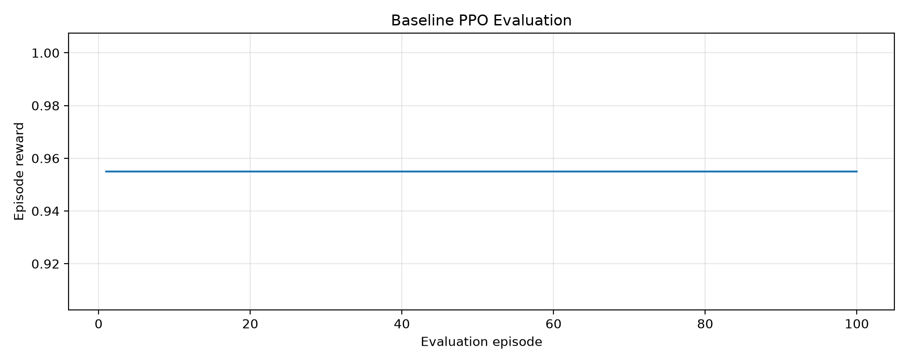
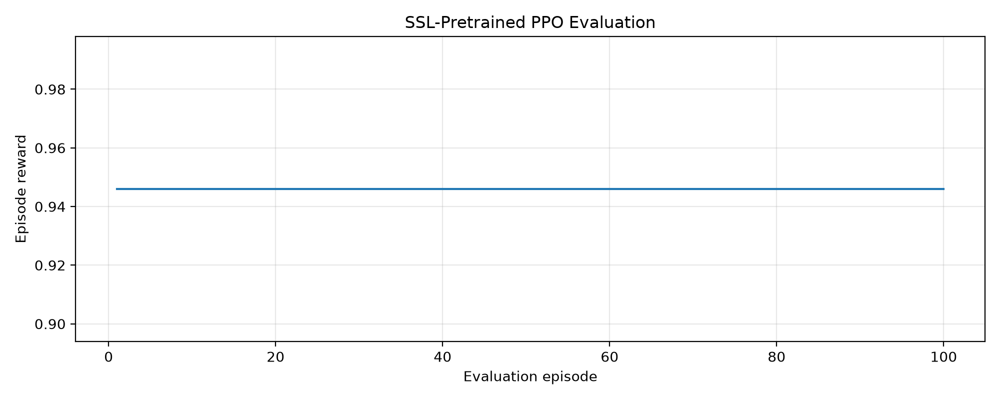
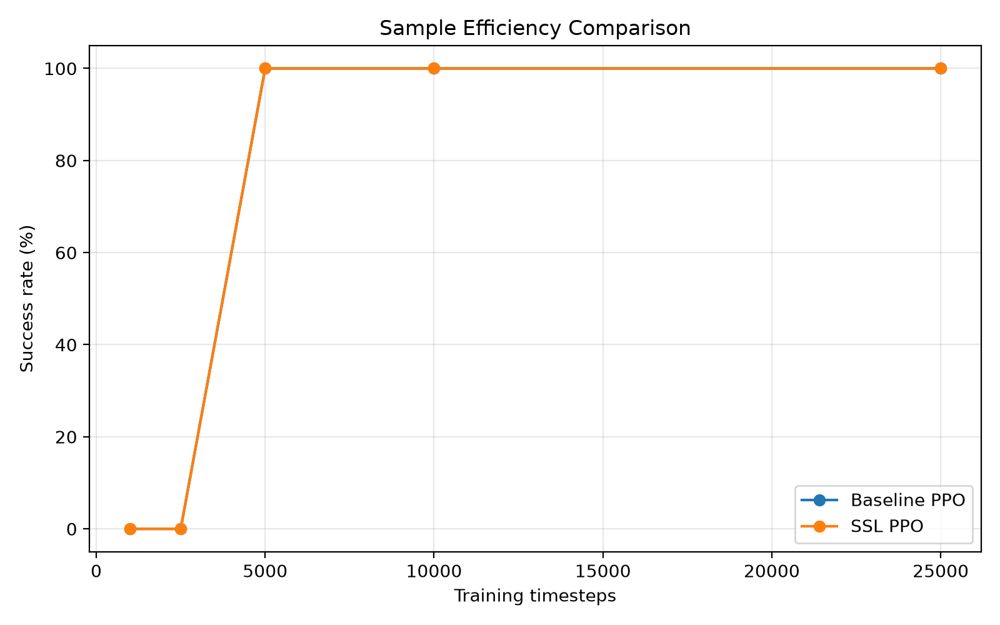

# Self-Supervised Representation Learning for Reinforcement Learning in MiniGrid

## 1. Introduction

Reinforcement learning agents often require a large number of interactions with an environment before learning an effective policy. When observations contain visual information, part of this difficulty comes from learning useful representations and decision-making behaviour simultaneously.

This project investigates whether self-supervised learning can improve reinforcement learning by first learning representations from unlabeled environment observations. The learned encoder will later be integrated into a reinforcement learning agent and compared with a baseline agent trained without self-supervised pretraining.

The experiments use MiniGrid, a lightweight visual navigation environment that supports controlled and reproducible reinforcement learning experiments.
---

## 2. Project Objectives

The main objectives of this project are:

* Collect unlabeled visual observations from a MiniGrid environment.
* Train a visual encoder using a self-supervised learning objective.
* Use the learned representation as input to a reinforcement learning agent.
* Compare the pretrained agent against a baseline reinforcement learning agent.
* Evaluate sample efficiency, training stability, and final performance.
---

## 3. Experimental Environment

The initial experiments use the `MiniGrid-Empty-5x5-v0` environment. The agent operates in a small grid and must navigate toward a target using a discrete action space.

The environment is intentionally simple so that the effect of self-supervised representation learning can be studied without unnecessary environmental complexity.

**Figure 1.** Initial state of the MiniGrid Empty 5×5 navigation environment.
---

## 4. Methodology

### 4.1 Data Collection

A dataset of 5,000 unlabeled observations was collected from the `MiniGrid-Empty-5x5-v0` environment using a random policy. Each observation contains a partial visual representation of the environment with dimensions `7 × 7 × 3`. These observations will be used to train the self-supervised encoder without relying on rewards, action labels, or manually annotated data.

**Figure 2.** Representative samples from the unlabeled MiniGrid observation dataset.

---
### 4.2 Self-Supervised Learning

A fully connected autoencoder was trained on the unlabeled MiniGrid observations using mean squared reconstruction error. The encoder maps each `7 × 7 × 3` observation to a 64-dimensional latent vector, while the decoder attempts to reconstruct the original input.

**Figure 3.** Comparison between original MiniGrid observations and their autoencoder reconstructions. The reconstruction quality provides an initial indication of whether the learned latent representation preserves the main visual structure of the environment.

---
### 4.3 Reinforcement Learning

To be completed after implementing the baseline and pretrained reinforcement learning agents.
-----
## 5. Experiments and Results

### 5.1 Baseline Reinforcement Learning Agent

As a reinforcement learning baseline, a PPO agent was trained directly on flattened raw image observations from the `MiniGrid-Empty-5x5-v0` environment. The agent was evaluated over 100 episodes using a deterministic policy.

The trained baseline achieved an **average reward of 0.9550** and a **success rate of 100.00%**, indicating that the task is learnable even without self-supervised pretraining.

**Figure 4.** Episode rewards obtained by the baseline PPO agent during evaluation over 100 episodes.

----
### 5.2 PPO with Self-Supervised Representations

A second PPO agent was trained using the 16-dimensional latent representations produced by the pretrained convolutional autoencoder. The encoder was frozen during reinforcement learning so that PPO learned its policy from the self-supervised representation rather than directly from the raw observation.

The SSL-based agent achieved an **average reward of 0.9460** and a **success rate of 100.00%** over 100 evaluation episodes.

**Figure 5.** Episode rewards obtained by the PPO agent trained on self-supervised latent representations.

The result shows that the learned representation retained sufficient information for successful navigation. Its average reward was slightly lower than the raw-observation baseline, which achieved `0.9550`, although both agents reached a `100%` success rate. This indicates that the compressed representation remained effective but did not improve final performance on this simple task.
----
### 5.3 Sample-Efficiency Comparison

To determine whether self-supervised pretraining accelerated reinforcement learning, both agents were trained from scratch using five different interaction budgets: 1,000, 2,500, 5,000, 10,000, and 25,000 timesteps.

**Figure 6.** Success rate of the baseline PPO agent and the SSL-based PPO agent at different training budgets.

Both agents achieved a `0%` success rate after 1,000 and 2,500 timesteps, then reached a `100%` success rate after 5,000 timesteps. The self-supervised representation therefore did not improve sample efficiency in this environment.

The baseline obtained an average reward of `0.9550`, while the SSL-based agent obtained `0.9460`. This small difference suggests that the compressed latent representation preserved enough information to solve the task, but did not provide an advantage over the raw flattened observation.
---
## 6. Discussion

The experiments show that self-supervised representation learning can produce a compact state representation that is sufficient for reinforcement learning. After correcting the preprocessing pipeline, the convolutional autoencoder compressed each MiniGrid observation from 147 input values to a 16-dimensional latent vector while still allowing PPO to achieve a 100% success rate.

The initial self-supervised model failed because MiniGrid observations were incorrectly treated as conventional RGB images and divided by 255. MiniGrid instead represents object type, colour, and state using categorical channels with much smaller value ranges. This preprocessing error produced nearly constant latent representations, preventing PPO from distinguishing between environment states and resulting in a 0% success rate.

After applying channel-specific normalization and retraining the convolutional autoencoder, the latent representations showed substantially greater variation. The retrained PPO agent then achieved an average reward of 0.9460 and a 100% success rate.

However, self-supervised pretraining did not outperform the baseline. Both agents required approximately 5,000 training timesteps to reach a 100% success rate, and the baseline achieved a slightly higher final average reward. The likely reason is that `MiniGrid-Empty-5x5-v0` is a simple environment whose raw observations are already compact and structured. Representation learning may provide greater benefits in larger environments, more visually complex tasks, or experiments with fewer labelled reward interactions.

The failed initial experiment remains an important result because it demonstrates that representation quality depends heavily on domain-appropriate preprocessing. A reconstruction model can achieve a decreasing loss without necessarily learning features that are useful for downstream decision-making.

---
## 7. Conclusion

This project combined self-supervised learning and reinforcement learning in a MiniGrid navigation task. A convolutional autoencoder was trained on 5,000 unlabeled observations, and its frozen 16-dimensional encoder was used as the input representation for a PPO agent.

The SSL-based agent successfully solved the task, achieving an average reward of 0.9460 and a 100% success rate. However, it did not outperform the baseline PPO agent, which achieved an average reward of 0.9550 and reached the same success rate after the same number of training timesteps.

The results show that self-supervised pretraining can produce a compact and usable representation, but its benefit depends on the complexity of the environment and the quality of the learned features. Future work should evaluate the approach in larger MiniGrid environments, use multiple random seeds, and compare reconstruction-based learning with contrastive or predictive self-supervised objectives.

